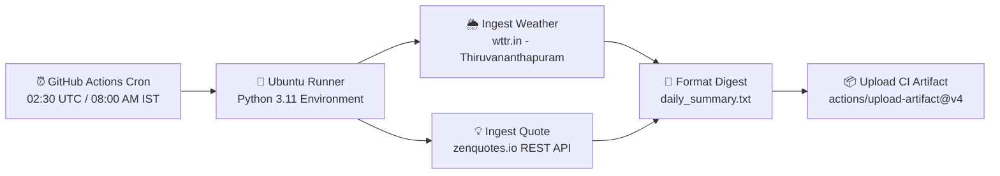

# Shawn Subin — Portfolio & Pulse Bot ⚡

[](https://github.com/Shawn-Subin/folio/actions/workflows/daily.yml)
[](https://python.org)
[](https://shawn-subin.github.io/folio/)
[](LICENSE)

A high-performance personal portfolio website built with modern CSS and vanilla JavaScript, paired with **Pulse** — an autonomous serverless Python daemon running daily via **GitHub Actions**.

---

## 🌟 Highlights

### 🎨 Personal Portfolio (`index.html`, `style.css`, `script.js`)
- **Zero Heavy Frameworks**: Pure HTML5, modern vanilla CSS tokens, and lightweight JavaScript.
- **Adaptive Dark / Light Theme**: System preference-aware with instant toggle and local storage persistence.
- **Micro-Interactions & Animations**: Responsive scroll reveals with IntersectionObserver, fluid card hovers, and animated progress bars.
- **Interactive Projects Showcase**:
  - **Campus Hub — Attendance Tracker**: PWA & React 18 student utility with 90% (5 internal marks) & 75% (eligibility) bunk calculation. [Live App](https://shawn-subin.github.io/Attendence-auto/) • [Repo](https://github.com/Shawn-Subin/Attendence-auto)
  - **Folio — Personal Website**: Accessible, performant web presence.
  - **Pulse — Daily Summary Bot**: Cloud automation daemon with live interactive widget and source code inspector.
- **Accessibility & SEO**: Semantic tags, WCAG color contrast, and meta tags.

---

## 🤖 Pulse — Daily Summary Bot

**Pulse** is a serverless Python daemon designed to run on a daily schedule in the cloud with zero hosting cost.

### ⚙️ How It Works



1. **Scheduled Cloud Execution**: GitHub Actions triggers the workflow every morning at `02:30 UTC` (`08:00 AM IST`).
2. **Meteorological Telemetry**: Fetches local weather conditions for Thiruvananthapuram via `wttr.in`.
3. **Motivational Ingestion**: Pulls curated daily wisdom via the `zenquotes.io` API with automated fallback handling.
4. **Summary Assembly**: Assembles a formatted daily briefing and writes to `daily_summary.txt`.
5. **Artifact Publishing**: GitHub Actions saves the generated summary as a downloadable workflow artifact.

---

### 💻 Bot Local Setup & Execution

To run the Pulse bot locally:

1. **Clone the repository**:
   ```bash
   git clone https://github.com/Shawn-Subin/folio.git
   cd folio
   ```

2. **Install Python dependencies**:
   ```bash
   pip install -r requirements.txt
   ```

3. **Run the bot**:
   ```bash
   python bot.py
   ```

4. **Inspect output**:
   The script prints the formatted summary to stdout and writes it to `daily_summary.txt`:
   ```text
   ========================
   PULSE - Daily Summary
   Thursday, 01 October 2026
   ========================

   Weather: Thiruvananthapuram: ⛅ +29°C

   Quote of the day:
   The secret of getting ahead is getting started. — Mark Twain
   ```

---

### ⚡ GitHub Actions Workflow (`.github/workflows/daily.yml`)

The bot is automated through the following scheduled workflow:

```yaml
name: Pulse - Daily Summary Bot

on:
  schedule:
    - cron: '30 2 * * *'  # 02:30 UTC = 08:00 AM IST daily
  workflow_dispatch:      # Enables manual trigger in Actions tab

jobs:
  run-pulse:
    runs-on: ubuntu-latest
    steps:
      - name: Checkout code
        uses: actions/checkout@v4

      - name: Set up Python
        uses: actions/setup-python@v5
        with:
          python-version: '3.11'

      - name: Install dependencies
        run: pip install -r requirements.txt

      - name: Run Pulse bot
        run: python bot.py

      - name: Upload summary as artifact
        uses: actions/upload-artifact@v4
        with:
          name: daily-summary
          path: daily_summary.txt
```

---

## 📁 Repository Structure

```
folio/
├── .github/
│   └── workflows/
│       └── daily.yml         # GitHub Actions cron workflow configuration
├── .gitignore                # Git exclusions (pycache, virtualenvs, outputs)
├── bot.py                    # Pulse Python automation daemon
├── index.html                # Portfolio semantic HTML5 entry point
├── requirements.txt          # Python dependencies (requests)
├── script.js                 # Theme toggler, API widgets, and tabs engine
├── style.css                 # Custom CSS design system tokens and layouts
└── README.md                 # Project documentation
```

---

## 📬 Contact & Connect

- **Email**: [shawnsubin@gmail.com](mailto:shawnsubin@gmail.com)
- **LinkedIn**: [shawn-subin-58728137b](https://www.linkedin.com/in/shawn-subin-58728137b/?isSelfProfile=true)
- **GitHub**: [@Shawn-Subin](https://github.com/Shawn-Subin)

---

## 📄 License

This project is open source and available under the [MIT License](LICENSE).
